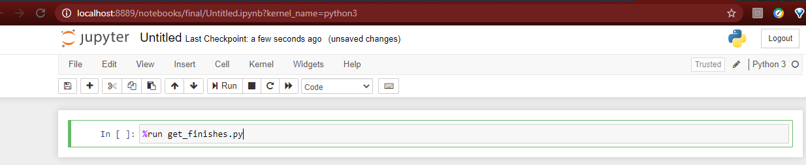

## Contents
<ol>
    <b><li>Introduction</li>
    <li>User Guide</li>
    <li>Suggestions and Disclaimers</li></b>
</ol>

## Introduction
<blockquote>The author enjoys the entertainment value that comes with the anticipation of a fight finish, and has made a script that takes a fighter ID as input then
filters and displays only bouts that have <b>not</b> gone the distance.</blockquote>

## User Guide
<ol>
    <li>Create a local virtual environment in your favourite way: Buraleh has done the following: </li> 
    <li>Activate the virtual environment using your command of choice or follow along with: </li> 
    <li>You should see the leftmost value in parenthesis change from 'base' to '.venv'. We can now safely install the requirements</li> 
    <li>Simply type in the following: </li> 
    <li>Fire up jupyter notebook or jupyter lab: </li> 
    <li>Open up a Python3 notebook and use the %run magic command to run the Python script: </li> 
    <li>You will then be prompted for a valid ufc fighter id, head over to <a href='http://ufcstats.com/'>ufcstats</a>, search for a fighter you'd like to watch and enter the id. The author has chosen Alistair Overeem:     </li> 
    <li>And...voila! Out comes a tidy table of decisive battles that 'The Demolition Man' or your fighter of choice has fought in. </li> 
</ol>

## Suggestions, Disclaimers and Contact
<ul>
    <li>The author may include business logic to check if input string matches a boxer id's pattern and then dispatches that a part of the script that scrapes for fight finishes from the site: <a href='https://boxrec.com/'>boxrec</a></li>
    <li>Obviously, the author is not the maintainer of <a href='http://ufcstats.com/'>ufcstats</a> and cannot guarantee this script's continued functionality in the future.</li>
    <li>Feel free to message me on <a href='https://www.linkedin.com/in/noorudin-buraleh-2243331a3/'>LinkedIn</a> regarding opportunities!</li>
</ul>
